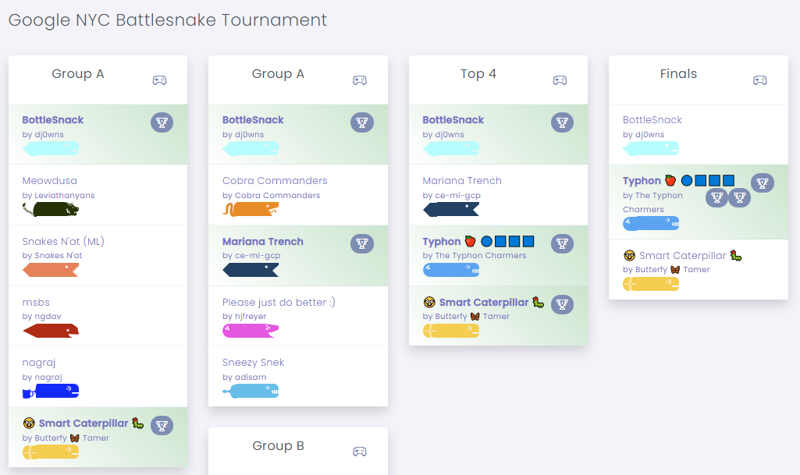
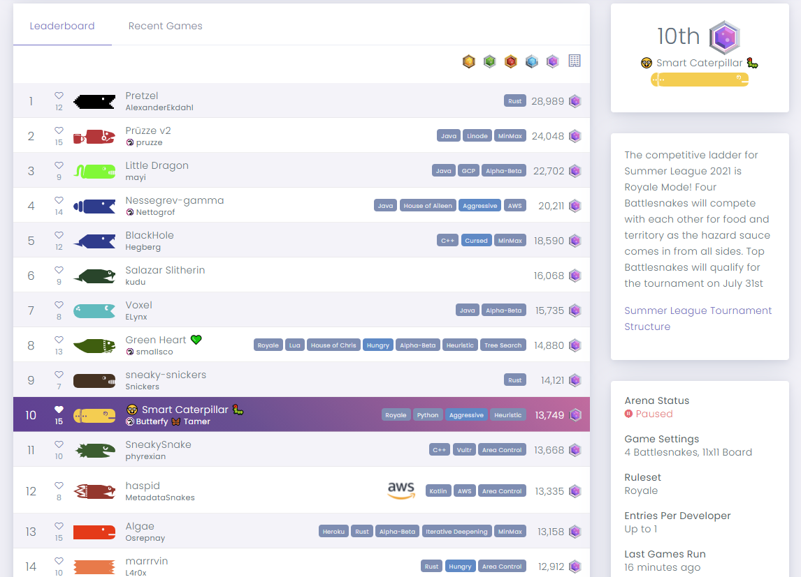

# Backstory of the Caterpillar BattleSnakes family

This is the story of the Caterpillar BattleSnakes family, their origins, achievements and future plans.

# The oldest brother: Hungry Caterpillar

In the middle of May 2021 Google NYC announced internal BattleSnake competition happening in early June. And that's when it all started.

I got familiar with the game rules, battlesnake server requirements, copied the official Python starter project and sketched a dirty-coded snake that:
* Looked for _one_ closest food.
* Found _one_ shortest path to it.
* Made the first step.

[Hungry Caterpillar](https://play.battlesnake.com/u/theapx/hungry-caterpillar/) was born. It had a different name and default style at that time. But it was able to [pass](https://play.battlesnake.com/g/a752804c-9ec6-4c0c-8138-04aeff65f856/?title=Survive+100) a few challenges, so I sent it to the wild - Global Arena.

My first battlesnake started climbing the ladder, but survival rate wasn't high. It made some obvious mistakes, and I added some exceptions to its `"choose one path to one food"` life principle. The principle changed to `"choose one path to one food, but ..."`, and the "but ..." part started growing.

My main approach was:
* Watch games that Hungry Caterpillar lost.
* Try to find the fatal mistake move that lead to elimination.
* Think carefully about better move in this specific situation.
* Create a unit test for this situation.
  * Hungry Caterpillar logs all `move` requests and json data.
* Modify existing rule or add a new rule for it.

I also tried to pass other challenges, but they required very special logic focused on challenges. This logic doesn't help much against other snakes, so I focused on skills for arenas instead.

`Dmitry's first BattleSnake :)` also got a new name inspired by [The Very Hungry Caterpillar toy](https://www.google.com/search?q=the+very+hungry+caterpillar). The "but ..." part of its life principle made it not so hungry anymore, so the name was shortened to `Hungry Caterpillar`.

# Global refactoring: Smart Caterpillar

At some point the Hungry Caterpillar's design around finding path to food made it hard to make further improvements. Inability to consider different paths and different food limited its growth as well. A major refactoring was required.

The "but ..." part of the life principle was much bigger than the main food finding part, so it was clear that food must not be at the core of the design anymore.

After a couple days of refactoring on a separate branch, most features were working, and most tests were passing. I wasn't sure how good it was, and I didn't want to ruin Hungry Caterpillar's ratings, so I created a new battlesnake - [Smart Caterpillar](https://play.battlesnake.com/u/theapx/smart-caterpillar/).

At the beginning it wasn't actually smarter than Hungry Caterpillar. I dropped some logic during refactoring, so its survival rate was a bit lower. But the new design opened new oportinities for growth.

The new design is exactly the same as The Very Hungry Caterpillar, which we will talk about later.

I added more and more rules to the Smart Caterpillar's code. Up to the point when the best explanation I could give to most loses was: "it's just bad luck". And the rest deserve this comment: "it _feels_ unsafe to move there, but I have no idea how to formalize that".

`Summer League 2021` and `Google NYC Battlesnake Tournament` were coming within a week, and I decided to not make any changes at that point. Once the Summer League started, I had to make some changes to adapt to royale rules of the league.

# Tournaments results

Smart Caterpillar reached the final round of `Google NYC Battlesnake Tournament`, but lost to a snake created by a team of 4 googlers. I think it's a really good result, and I'm proud of Smart Caterpillar!

Smart Caterpillar reached Elite Tier in `Summer League 2021` and [finished](https://play.battlesnake.com/arena/summer-league-2021/#leaderboard) 10th with 13,749 points. Unfortunately it didn't get to finals in the [tournament](https://play.battlesnake.com/competitions/summer-league-2021/summer-league-2021-elite/brackets/) and was defeated in quarter-finals.

# Future plans

Smart Caterpillar has already reached the point, where I don't have good ideas how to improve it. There are some minor things I have in my mind, but they won't affect survival rate much.

Right now I'm working on a completely new BattleSnake that I hope to finish by Fall League 2021. It will be implemented in C++ and needs an implementation game rules. So I [ported](https://github.com/TheApX/battlesnake-engine-cpp) official game rules to C++.

I also implemented a battlesnake [server framework](https://github.com/TheApX/battlesnake-engine-cpp/tree/main/server) based on open-source libraries. All you need to create your own battlesnake using this framework is to implement 4 core functions.

I've created The Very Hungry Caterpillar mainly to test the framework. But I also want to share what I've learned from it with you, so I open-sourced it and documented it thoroughly, including some theory behind it.

I hope it will help you learn something and create your own battlesnake. See you on the arena!

[Back to contents](../README.md#contents)
