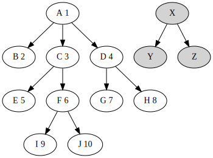
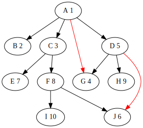
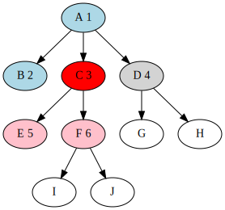
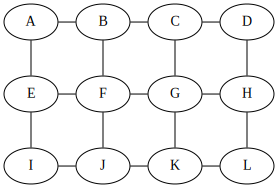
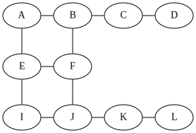

# Shortest path to food with BFS

This is the most important part of The Very Hungry Caterpillar implementation, and it is also important for your snake. Any snake that tries to be competitive needs to do some kind of graph traversal to understand what's going on around it. [Breadth-first search (BFS)](https://en.wikipedia.org/wiki/Breadth-first_search) and BFS-like algorithms are ofthen the best choise.

In this section we will discuss how BFS works, how it can help a battlesnake make better decisions, and how to modify it for more specific use-cases.

# Breadth-first search

[Wikipedia](https://en.wikipedia.org/wiki/Breadth-first_search) has a good explanation of BFS for trees. Important property of BFS is that it checks nodes of the tree layler-by-layer. It checks the roof first, then all nodes right below the root, then all nodes at 2 steps from the root, then at 3 steps, and so on.

This diagram shows the order of traversal, starting from `A`. Nodes `X`, `Y` and `Z` are not reachable from `A`, and are not visited.



BFS can be applied to not just trees, but regular graphs as well. It should just skip nodes visited (explored) earlier. Let's add a couple extra edges to the tree above. The order will change:



Node `G` is now processed before `D`, and `J` is processed before `F`.

The core of BFS is a FIFO (first in, first out) queue of nodes. Initially the queue contains just the root - the first node of traversal. Then the main cycle takes the first node in the queue and adds all not visited adjacent nodes to the end of the queue.

The main cycle ends when there are no nodes left in the queue. It may end eralier if a node that matches goal criteria is found. If there is no nodes mathing the goal criteria (or if there is no goal criteria), then BFS processes all nodes that can be reached from the initial one.

C++ implementation:

```c++
struct Node {
  // Array of adjacent nodes, ending with nullptr.
  Node* adjacent_nodes;
};

Node* BFS(Node* root) {
  std::queue<Node*> q;
  std::set<Node*> visited;

  // Push the root initially and mark it as visited.
  q.push(root);
  visited.insert(root);

  // Process queue until it's empty.
  while (!q.empty()) {
    // Pop the first element from the queue.
    Node* current = q.front();
    q.pop();
    // If we found the goal, return it.
    if (IsGoal(current)) {
      return current;
    }
    // Add all not visited adjacent nodes to the queue and mark them as visited.
    for (Node* adjacent = current->adjacent_nodes; adjacent != nullptr;
         ++adjacent) {
      if (visited.find(adjacent) == visited.end()) {
        visited.insert(adjacent);
        q.push(adjacent);
      }
    }
  }

  // If no goal found, return null.
  return nullptr;
}
```

# Distance between nodes

In addition to labeling nodes as explored, some extra calculations can be done when BFS processes a new node. For example, it can calculate distance (the number of steps) to each node from the start node. To do that, it needs to mark distance to a new adjacent node `w` as distance to currently processed node `v` plus 1. Because BFS processes nodes closer to the start node first, it always finds the shortest distance.

Let's modify the implementation above to calculate distances. The `distances` map can serve as the `visited` set - all visited nodes will have distance calculated. The `BFS` function now returns distance to the goal or `-1` if the goal is not found.

```c++
struct Node {
  // Array of adjacent nodes, ending with nullptr.
  Node* adjacent_nodes;
};

int BFS(Node* root) {
  std::queue<Node*> q;
  std::unordered_map<Node*, int> distances;

  // Push the root initially and mark it as visited.
  q.push(root);
  distances[root] = 0;

  // Process queue until it's empty.
  while (!q.empty()) {
    // Pop the first element from the queue.
    Node* current = q.front();
    q.pop();
    // If we found the goal, return it.
    if (IsGoal(current)) {
      return distances[current];
    }
    // Add all not visited adjacent nodes to the queue and mark them as visited.
    for (Node* adjacent = current->adjacent_nodes; adjacent != nullptr;
         ++adjacent) {
      if (distances.find(adjacent) == distances.end()) {
        distances[adjacent] = distances[current] + 1;
        q.push(adjacent);
      }
    }
  }

  // If no goal found, return -1, which is not a valid distance.
  return -1;
}
```

If we remove the `IsGoal(current)` check and return the `distances` map, this function will calculate distances to all nodes reachable from the root.

Let's take a look at the graph in the middle of the process, when the node `C` is processed. Blue nodes `A` and `B` are already processed and removed from the queue. Red node `C` is being processed right now. Grey `D` waits in the queue, and pink nodes `E` and `F` will be added when `C` is processed. White nodes are not even in the queue yet, and don't have distances calculated.



# Game board as a graph

Let's label each cell of a 4x3 game board:

|       |       |       |       |
| :---: | :---: | :---: | :---: |
|   A   |   B   |   C   |   D   |
|   E   |   F   |   G   |   H   |
|   I   |   J   |   K   |   L   |

It can be represented as the following graph:



If cells `G` and `H` are occupied by a snake, the graph will look like this:

|       |       |       |       |
| :---: | :---: | :---: | :---: |
|   A   |   B   |   C   |   D   |
|   E   |   F   |       |       |
|   I   |   J   |   K   |   L   |



# Path to food

> Note: this is **not** how The Very Hungry Caterpillar is implemented. Though this works, it can be optimized further. But before optimizing, let's start with simple solution.

Let's consider a board below. `O` is the head and `o` is body of our snake, and `x` is food. Dots `.` are empty cells.

|       |       |       |       |       |       |
| :---: | :---: | :---: | :---: | :---: | :---: |
|   .   |   .   | **o** | **O** |   .   |   .   |
| **o** | **o** | **o** |   .   |   .   |   .   |
|   .   |   .   |   .   |   .   |   .   |   .   |
|   .   |   .   |   .   |   .   | **x** |   .   |
| **x** |   .   |   .   |   .   |   .   |   .   |

We can use BFS and calculate distances from the head. Two cells in the top-left corner are blocked by snake's body and thus unreachable. We need to be careful with the head, because its cell is marked as occupied and is thus not part of the graph. We can jsut mark it as not occupied to make code simpler.

|         |       |       |       |         |       |
| :-----: | :---: | :---: | :---: | :-----: | :---: |
|    .    |   .   | **o** | **O** |    1    |   2   |
|  **o**  | **o** | **o** |   1   |    2    |   3   |
|    5    |   4   |   3   |   2   |    3    |   4   |
|    6    |   5   |   4   |   3   | 4 **x** |   5   |
| 7 **x** |   6   |   5   |   4   |    5    |   6   |

We could also stop search when some food is found (food is the goal criteria). BFS will go no more than 4 steps away from the head in this case.

|       |       |       |       |         |       |
| :---: | :---: | :---: | :---: | :-----: | :---: |
|   .   |   .   | **o** | **O** |    1    |   2   |
| **o** | **o** | **o** |   1   |    2    |   3   |
|   .   |   4   |   3   |   2   |    3    |   4   |
|   .   |   .   |   4   |   3   | 4 **x** |   .   |
| **x** |   .   |   .   |   4   |    .    |   .   |

Now let's reconstruct actual path. We know coordinates of the closest food and distance to it. We also know cells adjacent to it. And we know that all cells on the shortest path are exactly one step away from the previous cell. I.e. if we follow the path, distances will be: `1`, `2`, `3`, `4`. The last one is food, and an cell adjacent to food with distance `3` is part of the path.

Just check all adjacent cells and find a cell with distance `3`. There may be multiple shortest paths, and any cell will be ok if we just want to find one of them. Let's draw the board again and mark cells that we know are on the path:

|       |       |       |        |         |       |
| :---: | :---: | :---: | :----: | :-----: | :---: |
|   .   |   .   | **o** | **O**  |    1    |   2   |
| **o** | **o** | **o** |   1    |    2    |   3   |
|   .   |   4   |   3   |   2    |    3    |   4   |
|   .   |   .   |   4   | **>3** | **>4x** |   .   |
| **x** |   .   |   .   |   4    |    .    |   .   |

We can repeat the same process and find a cell at the distance `2` close to the cell at the distance `3`. Then similarly find the cell at the distance `1`, and we have the whole path.

|       |       |       |        |         |       |
| :---: | :---: | :---: | :----: | :-----: | :---: |
|   .   |   .   | **o** | **O**  |    1    |   2   |
| **o** | **o** | **o** | **>1** |    2    |   3   |
|   .   |   4   |   3   | **>2** |    3    |   4   |
|   .   |   .   |   4   | **>3** | **>4x** |   .   |
| **x** |   .   |   .   |   4    |    .    |   .   |

C++ implementation (for a general case, not game board):

```c++
std::vector<Node*> ReconstructPath(std::unordered_map<Node*, int>& distances,
                                   Node* destination) {
  std::vector<Node*> reversed_result;

  // Start with the last step, and find the previous ones in cycle.
  Node* current = destination;
  while (distances[current] != 0) {
    // Remember current step.
    reversed_result.push_back(current);
    // Find the previous step.
    // This assumes that the graph is non-directional.
    for (Node* adjacent = current->adjacent_nodes; adjacent != nullptr;
         ++adjacent) {
      // We are looking for a node at distance N-1.
      if (distances[adjacent] == distances[current] - 1) {
        current = adjacent;
        break;
      }
    }
  }

  // `reversed_result` now contains all steps except the initial node in
  // the reversed order. Reverse it and return.
  std::vector<Node*> result;
  for (int i = reversed_result.size() - 1; i >= 0; --i) {
    result.push_back(reversed_result[i]);
  }
  return result;
}
```

Our hungry snake can go to the first step of the path returned by `ReconstructPath`, and it will go to the closest food. The only thing you need to check is that there is a food that the snake can reach. For example, there is no path in this case:

|       |       |       |       |       |       |
| :---: | :---: | :---: | :---: | :---: | :---: |
|   .   |   .   | **o** | **O** |   1   |   2   |
|   .   |   .   | **o** |   1   |   2   |   3   |
|   .   |   .   | **o** |   2   |   3   |   4   |
|   .   |   .   | **o** |   3   |   4   |   5   |
| **x** |   .   | **o** |   4   |   5   |   6   |

# Multiple paths

The algorithm above finds exactly one path to exactly one closest food. In many cases there are multiple different paths, and there may even be multiple food at the same distance. From the perspective of "going to the closest food" it doesn't really matter which of the closest food to go to and which path to follow.

Let's solve the problem for multiple paths to the same food first. Let's consider this game board, which has only one food.

|       |       |       |       |       |       |
| :---: | :---: | :---: | :---: | :---: | :---: |
| **o** | **o** | **o** |   .   |   .   |   .   |
|   .   |   .   | **o** | **O** |   .   |   .   |
|   .   |   .   |   .   |   .   |   .   |   .   |
|   .   |   .   |   .   |   .   | **x** |   .   |
|   .   |   .   |   .   |   .   |   .   |   .   |

In a non-directional graph the shortest path from node `A` to node `B` is in fact the reversed shortest path from node `B` to node `A`. Let's find the shortest path from the food to the head instead.

|       |       |       |       |         |       |
| :---: | :---: | :---: | :---: | :-----: | :---: |
| **o** | **o** | **o** |   4   |    3    |   4   |
|   6   |   5   | **o** | **O** |    2    |   3   |
|   5   |   4   |   3   |   2   |    1    |   2   |
|   4   |   3   |   2   |   1   | 0 **x** |   1   |
|   5   |   4   |   3   |   2   |    1    |   2   |

The head cell is occupied, so it's not part of the graph, and we don't calculate the distance at it. But as you can see later, it is not needed anyway.

Now remember how we reconstructed the path - we looked for a cell adjacent to the destination, which had distance equal to `N-1`. In this case we don't know distance `N` at the head. But let's check all cells adjacent to the head, and see what options we have.

Cell above is `4` steps away from food, cell below is `2` steps away and cell on the right is also `2` steps away. If an adjacent cell can be reached in `2` steps, then the cell itself can be reached in no more than `N=3` steps. So to get distance to the head we find the minimum distance to adjacent cells and increase it by `1`.

Now we can find the reversed path. But we don't really need the whole path, we just need to decide the first step. Any adjacent cell at the distance equal to `N-1=2` lays on a shortest path. The snake can go to any of them - and that's how we find *all* first steps that go to the closest food!

In fact, we don't even need to calculate `N`. We just find the minimum distance to adjacent cells and go to any cell at that distance. And that's exactly what The Very Hungry Caterpillar does.

# Multiple closest food

Now let's generalize this approach for multiple food. Consider this game board:

|       |       |       |       |       |
| :---: | :---: | :---: | :---: | :---: |
|   .   |   .   |   .   |   .   |   .   |
|   .   |   .   | **O** |   .   |   .   |
| **x** |   .   | **o** |   .   | **x** |
|   .   |   .   | **o** |   .   |   .   |
|   .   |   .   | **o** |   .   | **x** |

Similarly to multiple paths, let's calculate distances from food. We can process each food individually and calculate distances from it. Distances for three food are:

Food on the left:

|         |       |       |       |          |
| :-----: | :---: | :---: | :---: | :------: |
|    2    |   3   |   4   |   5   |    6     |
|    1    |   2   | **O** |   6   |    7     |
| 0 **x** |   1   | **o** |   7   | 8 **x**  |
|    1    |   2   | **o** |   8   |    9     |
|    2    |   3   | **o** |   9   | 10 **x** |

Food on the right:

|         |       |       |       |         |
| :-----: | :---: | :---: | :---: | :-----: |
|    6    |   5   |   4   |   3   |    2    |
|    7    |   6   | **O** |   2   |    1    |
| 8 **x** |   7   | **o** |   1   | 0 **x** |
|    9    |   8   | **o** |   2   |    1    |
|   10    |   9   | **o** |   3   | 2 **x** |

Food in the bottom-right corner:

|          |       |       |       |         |
| :------: | :---: | :---: | :---: | :-----: |
|    8     |   7   |   6   |   5   |    4    |
|    9     |   8   | **O** |   4   |    3    |
| 10 **x** |   9   | **o** |   3   | 2 **x** |
|    11    |  10   | **o** |   2   |    1    |
|    12    |  11   | **o** |   1   | 0 **x** |

Now we have 3 distance values in each cell. Let's keep minimum of 3 values for each cell:

|         |       |       |       |         |
| :-----: | :---: | :---: | :---: | :-----: |
|    2    |   3   |   4   |   3   |    2    |
|    1    |   2   | **O** |   2   |    1    |
| 0 **x** |   1   | **o** |   1   | 0 **x** |
|    1    |   2   | **o** |   2   |    1    |
|    2    |   3   | **o** |   1   | 0 **x** |

What can we tell form this information?
* Cell above the head lays on a path to a food at the distance of 4 steps.
* Cells on the left and on the right lay on paths to a food at the distance of 2 steps.
* If we go left, we will reach some food in 2 steps.
* If we go right, we will reach some food in 2 steps.

This is exactly what we need! But we do BFS 3 times - one for each food. Can we optimize it somehow?

# BFS with multiple starting points

In regular BFS we add the starting point of the search to the queue, and then process the queue. But we can add multiple starting points. Let's see what happens.

The board now contains coordinates, so that it's easier to point to specific cells. At the very beginning before the main cycle starts, the board looks like this:

|          |    0    |   1   |   2   |   3   |    4    |
| -------- | :-----: | :---: | :---: | :---: | :-----: |
| **4** \| |    .    |   .   |   .   |   .   |    .    |
| **3** \| |    .    |   .   | **O** |   .   |    .    |
| **2** \| | 0 **x** |   .   | **o** |   .   | 0 **x** |
| **1** \| |    .    |   .   | **o** |   .   |    .    |
| **0** \| |    .    |   .   | **o** |   .   | 0 **x** |

And the queue has 3 elements: `(0,2)`, `(4,2)` and `(4,0)`.

When the first item `(0,2)` is processed, BFS will queue its adjacent cells and mark their distances:

|          |    0    |   1   |   2   |   3   |    4    |
| -------- | :-----: | :---: | :---: | :---: | :-----: |
| **4** \| |    .    |   .   |   .   |   .   |    .    |
| **3** \| |    1    |   .   | **O** |   .   |    .    |
| **2** \| | 0 **x** |   1   | **o** |   .   | 0 **x** |
| **1** \| |    1    |   .   | **o** |   .   |    .    |
| **0** \| |    .    |   .   | **o** |   .   | 0 **x** |

Queue: `(4,2)`, `(4,0)`, `(0,1)`, `(1,2)`, `(0,3)`.

After processing the next item in the queue:

|          |    0    |   1   |   2   |   3   |    4    |
| -------- | :-----: | :---: | :---: | :---: | :-----: |
| **4** \| |    .    |   .   |   .   |   .   |    .    |
| **3** \| |    1    |   .   | **O** |   .   |    1    |
| **2** \| | 0 **x** |   1   | **o** |   1   | 0 **x** |
| **1** \| |    1    |   .   | **o** |   .   |    1    |
| **0** \| |    .    |   .   | **o** |   .   | 0 **x** |

Queue: `(4,0)`, `(0,1)`, `(1,2)`, `(0,3)`, `(4,1)`, `(3,2)`, `(4,3)`.

And then it gets interesing. When the next item `(4,0)` is processed, it will queue only `(3,0)`. It will skip `(4,1)` because it is already in the queue.

After processing the next item in the queue:

|          |    0    |   1   |   2   |   3   |    4    |
| -------- | :-----: | :---: | :---: | :---: | :-----: |
| **4** \| |    .    |   .   |   .   |   .   |    .    |
| **3** \| |    1    |   .   | **O** |   .   |    1    |
| **2** \| | 0 **x** |   1   | **o** |   1   | 0 **x** |
| **1** \| |    1    |   .   | **o** |   .   |    1    |
| **0** \| |    .    |   .   | **o** |   1   | 0 **x** |

Queue: `(0,1)`, `(1,2)`, `(0,3)`, `(4,1)`, `(3,2)`, `(4,3)`, `(3,0)`.

When all cells at the distance of `1` step will be processed, the game board will look like this:

|          |    0    |   1   |   2   |   3   |    4    |
| -------- | :-----: | :---: | :---: | :---: | :-----: |
| **4** \| |    2    |   .   |   .   |   .   |    2    |
| **3** \| |    1    |   2   | **O** |   2   |    1    |
| **2** \| | 0 **x** |   1   | **o** |   1   | 0 **x** |
| **1** \| |    1    |   2   | **o** |   2   |    1    |
| **0** \| |    2    |   .   | **o** |   1   | 0 **x** |

When the process ends, the game board will be this:

|          |    0    |   1   |   2   |   3   |    4    |
| -------- | :-----: | :---: | :---: | :---: | :-----: |
| **4** \| |    2    |   3   |   4   |   3   |    2    |
| **3** \| |    1    |   2   | **O** |   2   |    1    |
| **2** \| | 0 **x** |   1   | **o** |   1   | 0 **x** |
| **1** \| |    1    |   2   | **o** |   2   |    1    |
| **0** \| |    2    |   3   | **o** |   1   | 0 **x** |

As you can see, the result is exactly the same as we got by calculating steps from each individual food. But this time we got it in a single pass, which is obviously more efficient. And this is exactly what The Very Hungry Caterpillar Does.

In addition to distances we can also keep information, which starting point this distance is from. The diagram we get in this case is called [Voronoi diagram](https://en.wikipedia.org/wiki/Voronoi_diagram). It may be useful for battlesnakes, for example it can help estimate area controlled by different snakes.

# The Very Hungry Caterpillar implementation

Finally, let's take a look at actual code of The Very Hungry Caterpillar. In this section we will focus on how steps to closest food are calculated. Read more about how these steps are used in the [previous section](basic_rules.md).

Board matrix and steps from food are calculated in the [MoveComparator::initBoardMatrix()](../move_comparator.cpp) function. It fills the matrix with `kMatrixUninitialized` values, calls `markSnakeBodiesOnMatrix()` to mark cells occupied by snakes with `kMatrixSnakeBody` values, and then calls `computeStepsFromFood()`.

`computeStepsFromFood()` implements the algorithm discussed above. If adds all food to BFS queue, and marks it as reachable in 0 steps. Then it processes the queue until it is empty. Adjacent cells are cells around current cell: on the left, right, top and bottom. Adjacent cells outside of the board are ignored, as well as cells occupied by snakes (number of steps equal to `kMatrixSnakeBody`). If number of steps is other than `kMatrixUninitialized`, the cells is already visited, and skipped. Then it is pushed to the queue, and numbers of steps is recorded.

[Back to contents](../README.md#contents)
